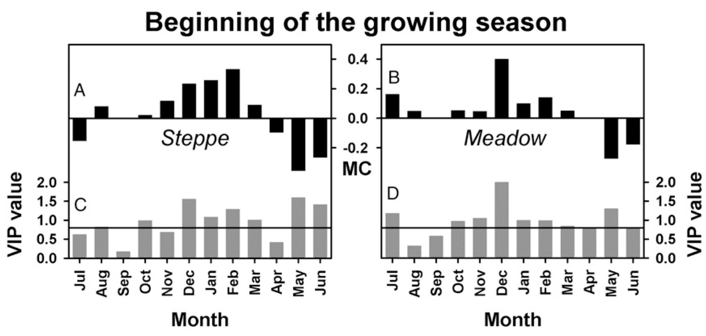

# Successes and limitations of PLS regression analysis

## Learning goals

-   Learn about the mixed success of applying PLS regression in various contexts
-   Understand important limitations of PLS regression

## PLS regression

The previous lesson introduced Projection-to-Latent-Structures (PLS) regression, a method for correlating high-resolution temperature data (e.g., daily) with low-resolution annual phenology events. In phenology analysis at Klein-Altendorf, this approach effectively identified the forcing period (where warm temperatures accelerate bloom) for pears but failed to detect the chilling phase. This contrasted with a study on walnut leaf emergence in California, where both dormancy phases were clearly observed. Further examples will explore where and why PLS regression is effective.

## PLS examples

### Grasslands on the Tibetan Plateau

An early application of the PLS methodology examined how grasslands on the Tibetan Plateau respond to temperature changes, focusing on the start of the growing season under climate change. Initially, there was a clear trend of earlier growth until the late 1990s, but this was followed by an unexpected delay in green-up dates.

![Beginning of the growing season (BGS) for steppe (A) and meadow (B) vegetation on the Tibetan Plateau between 1982 and 2006, derived from 15-day NDVI composites obtained from the Advanced Very High Resolution Radiometer (AVHRR) sensor. BGS dates advanced markedly between 1982 and the mid 1990s, before retreating significantly after that. Consistent increases in temperature (C and D) indicate that observed changes are not linear responses to temperature. Lines in the graph represent 3-year running means (Yu et al., 2010)](images/PLS_Tibet_1.png)

Similar to findings for walnuts in California, a clear relationship was observed on the Tibetan Plateau between warm winter temperatures and a delayed start to the growing season in spring.



Between 1982 and 2006, PLS regression analysis revealed that both winter (October–March) and spring (May–June) temperatures significantly influenced the beginning of the growing season (BGS) for steppe and meadow vegetation on the Tibetan Plateau. Variable importance plots (VIP) identified these periods as critical (VIP \> 0.8). Model coefficients showed that warm winters delayed spring phenology, while warm spring temperatures advanced BGS. Incorporating both effects into phenological models could improve understanding of climate change impacts on vegetation in temperate and cold regions (Yu et al., 2010). A spatial analysis later examined these temperature responses on a pixel-by-pixel scale.


The temperature response of grasslands mirrors the pattern seen in walnuts in California, though the underlying mechanisms likely differ and require deeper ecological knowledge. Unexpectedly, rising temperatures have not led to an earlier start of the growing season, suggesting a mismatch between existing ecosystems and future climatic conditions. This misalignment could threaten sustainability and create opportunities for invasive species better suited to exploit changing thermal resources. Shifting focus back to deciduous trees may provide clearer insights.

### Deciduous trees

Early PLS analyses of tree phenology involved collaboration with Guo Liang, who was a PhD student at the Kunming Institute of Botany, China, under Xu Jianchu, head of the East and Central Asia office of World Agroforestry. Guo Liang, now a Full Professor at Northwest A&F University in China, conducted an initial analysis on the phenology of Chinese chestnuts (*Castanea mollissima*) grown in Beijing. The findings are summarized below:

![Results of Partial Least Squares (PLS) regression correlating first flowering dates for chestnut at Beijing Summer Palace with 11-day running means of daily mean temperatures from the previous July to June. Blue bars in the top panel indicate VIP values greater than 0.8, the threshold for variable importance. In the middle and bottom panels, red color means the model coefficients are negative (and important), while the green color indicates positive (and important) relationships between flowering and temperature. The black line in the bottom figure stands for the mean temperatures, while the gray, green and red areas represent the standard deviation of daily mean temperatures for each day of the year (Guo et al., 2013)](images/PLS_chestnut.png)

The analysis highlights a clearly defined forcing period, with consistent negative model coefficients from January to May. The chilling period is only partially visible, characterized by inconsistent model coefficients and interruptions, often with many values deemed unimportant. A similar pattern emerged in an analysis of cherry phenology from Campus Klein-Altendorf, showing comparable results.

![Results of Partial Least Squares (PLS) regression of bloom dates for cv. ‘Schneiders späte Knorpelkirsche’ cherries in Klein-Altendorf, Germany, with 11-day running means of daily mean temperatures. The top panel shows Variable Importance in the Projection (VIP) scores, the middle panel model coefficients of the centered and scaled data, and the bottom panel mean temperatures (black line) and their standard deviation (grey areas). Blue bars in the top panel indicate values above 0.8, the threshold for variable importance. In the middle and bottom figures, data for these dates is shown in red whenever model coefficients are negative, and green when they are positive (Luedeling et al., 2013b)](images/PLS_CKA_cherries.png)

The analysis once again reveals a pronounced forcing phase, following a chilling period that is difficult to delineate. A recurring pattern emerges: the forcing phase is consistently clear, while the chilling phase remains obscure. This contrasts with the clearer results observed in earlier studies conducted in California.


### Why we’re not seeing the chilling phase

The failure of the chilling phase to appear in the PLS regression output doesn’t necessarily mean the method is ineffective. Instead, it highlights that PLS is sensitive to certain patterns of response, specifically those that are monotonically related to changes in temperature or other signals. In the case of spider mites, PLS was able to detect mite damage based on the amount of reflected radiation, with higher reflectance indicating more severe damage. Similarly, for the forcing phase in phenology, PLS responded to temperature, where higher temperatures led to greater heat accumulation and earlier bloom.

The key difference lies in how chilling accumulation works compared to forcing. In the cases of spider mites and forcing phases, changes in the signal (e.g., temperature or radiation) directly correlate with changes in the response variable (e.g., bloom timing or damage severity). However, chilling accumulation doesn't follow a simple, monotonic relationship with temperature, as it depends on more complex dynamics, such as the duration of cool temperatures within a specific range.

To better understand why PLS struggles with the chilling phase, it is helpful to examine the effective temperature ranges for various chill models and compare these to the winter temperatures observed at the study locations (e.g., Klein-Altendorf, Beijing, and Davis). By analyzing these factors, it becomes clear why the PLS method is less effective for detecting chilling accumulation.

```{r message=FALSE, warning=FALSE}
library(chillR)
library(dormancyR)
library(ggplot2)
library(kableExtra)
library(patchwork)
library(tidyverse)


hourly_models <- 
  list(
    Chilling_units = chilling_units,
    Low_chill = low_chill_model,
    Modified_Utah = modified_utah_model,
    North_Carolina = north_carolina_model,
    Positive_Utah = positive_utah_model,
    Chilling_Hours = Chilling_Hours,
    Utah_Chill_Units = Utah_Model,
    Chill_Portions = Dynamic_Model)

daily_models <-
  list(
    Rate_of_Chill = rate_of_chill, 
    Exponential_Chill = exponential_chill,
    Triangular_Chill_Haninnen = triangular_chill_1,
    Triangular_Chill_Legave = triangular_chill_2)

metrics <- c(names(daily_models),
             names(hourly_models))

model_labels <- c("Rate of Chill",
                  "Exponential Chill",
                  "Triangular Chill (Häninnen)",
                  "Triangular Chill (Legave)",
                  "Chilling Units",
                  "Low-Chill Chill Units",
                  "Modified Utah Chill Units",
                  "North Carolina Chill Units",
                  "Positive Utah Chill Units",
                  "Chilling Hours",
                  "Utah Chill Units",
                  "Chill Portions")


for(T in -20:30)
 {
  hourly <- sapply( hourly_models,
                    function(x)
                      x(rep(T,1000))
                    )[1000,]
 
  temp_frame <- data.frame(Tmin = rep(T,1000),
                           Tmax = rep(T,1000),
                           Tmean = rep(T,1000))
  
  daily <- sapply( daily_models,
                   function(x) 
                     x(temp_frame)
                   )[1000,]
 
  if(T == -20)
    sensitivity <- c(T = T,
                     daily,
                     hourly) else   
      sensitivity <- rbind(sensitivity,
                           c(T = T,
                             daily,
                             hourly))
  }

sensitivity_normal <- 
  as.data.frame(cbind(sensitivity[,1],
                      sapply(2:ncol(sensitivity),
                             function(x)
                               sensitivity[,x]/max(sensitivity[,x]))))

colnames(sensitivity_normal) <- colnames(sensitivity)

sensitivity_gg <- 
  sensitivity_normal %>%
  pivot_longer(Rate_of_Chill:Chill_Portions)
  
 # melt(sensitivity_normal,id.vars="T")
sensitivity_gg$value[sensitivity_gg$value<=0.001] <- NA


chill<-
  ggplot(sensitivity_gg,
         aes(x = T,
             y = factor(name),
             size = value)) +
  geom_point(col = "light blue") +
  scale_y_discrete(labels = model_labels) +
  ylab("Chill model") +
  xlab("Temperature (assumed constant, °C)") +
  xlim(c(-30, 40)) +
  theme_bw(base_size = 15) +
  labs(size = "Chill \nWeight")
```

```{r warning=FALSE}
chill
```

Winter temperatures at the three locations (Klein-Altendorf, Beijing, and Davis) can be summarized by obtaining and processing the relevant temperature data. Once the data files are saved in the data subfolder of the working directory, the provided code will process and analyze the temperatures. This enables the comparison of winter temperature patterns across the locations and their influence on phenological responses.

```{r, echo=FALSE}
read_tab("data/TMaxTMin1958-2019_patched.csv") %>%
  download_this(
    output_name = "TMaxTMin1958-2019_patched",
    output_extension = ".csv",
    button_label = "Download weather data for Klein-Altendorf",
    button_type = "warning",
    has_icon = TRUE,
    icon = "fa fa-save"
  )

read_tab("data/Beijing_weather.csv") %>% 
  download_this(
    output_name = "Beijing_weather",
    output_extension = ".csv",
    button_label = "Download weather data for Beijing",
    button_type = "warning",
    has_icon = TRUE,
    icon = "fa fa-save"
  )

read_tab("data/Davis_weather.csv") %>% 
  download_this(
    output_name = "Davis_weather",
    output_extension = ".csv",
    button_label = "Download weather data for Davis",
    button_type = "warning",
    has_icon = TRUE,
    icon = "fa fa-save"
  )

```

```{r message=FALSE, warning=FALSE}
KA_temps <- read_tab("data/TMaxTMin1958-2019_patched.csv") %>%
  make_JDay() %>%
  filter(JDay > 305 | JDay < 90) %>%
  stack_hourly_temps(latitude = 50.6)


hh_KA <- hist(KA_temps$hourtemps$Temp,
              breaks = c(-30:30),
              plot=FALSE)

hh_KA_df <- data.frame(
  T = hh_KA$mids,
  name = "Klein-Altendorf, Germany",
  value = hh_KA$counts / max(hh_KA$counts))

hh_KA_df$value[hh_KA_df$value == 0] <- NA


Beijing_temps <- read_tab("data/Beijing_weather.csv") %>%
  make_JDay() %>%
  filter(JDay > 305 | JDay < 90) %>%
  stack_hourly_temps(latitude = 39.9)

hh_Beijing <- hist(Beijing_temps$hourtemps$Temp,
                   breaks = c(-30:30),
                   plot=FALSE)

hh_Beijing_df<-data.frame(
  T = hh_Beijing$mids,
  name = "Beijing, China",
  value = hh_Beijing$counts / max(hh_Beijing$counts))

hh_Beijing_df$value[hh_Beijing_df$value==0]<-NA


Davis_temps <- read_tab("data/Davis_weather.csv") %>%
  make_JDay() %>%
  filter(JDay > 305 | JDay < 90) %>%
  stack_hourly_temps(latitude = 38.5)


hh_Davis <- hist(Davis_temps$hourtemps$Temp,
              breaks = c(-30:40),
              plot=FALSE)

hh_Davis_df <- data.frame(
  T = hh_Davis$mids,
  name = "Davis, California",
  value = hh_Davis$counts / max(hh_Davis$counts))

hh_Davis_df$value[hh_Davis_df$value == 0] <- NA


hh_df<-rbind(hh_KA_df,
             hh_Beijing_df,
             hh_Davis_df)

locations<-
  ggplot(data = hh_df,
         aes(x = T,
             y = name,
             size = value)) +
  geom_point(col = "coral2") +
  ylab("Location") +
  xlab("Temperature (between November and March, °C)") + 
  xlim(c(-30, 40)) +
  theme_bw(base_size = 15) +
  labs(size = "Relative \nfrequency")
```

```{r warning=FALSE}
locations
```

To compare the plots, the results can be combined into one figure using the `patchwork` package:

```{r warning=FALSE}
plot <- (chill +
             locations +
             plot_layout(guides = "collect",
                         heights = c(1, 0.4))
           ) & theme(legend.position = "right",
                     legend.text = element_text(size = 10),
                     legend.title = element_text(size = 12))

plot
```

To simplify the analysis, the focus can be shifted to plotting chill according to the Dynamic Model, as it is a more reliable approach compared to some of the other models. This will help in creating a clearer, more focused visualization of chill accumulation and its relationship with temperature.

```{r warning=FALSE}
chill <-
  ggplot(sensitivity_gg %>%
           filter(name == "Chill_Portions"),
         aes(x = T,
             y = factor(name),
             size=value)) +
  geom_point(col = "light blue") +
  scale_y_discrete(labels = "Chill Portions") +
  ylab("Chill model") +
  xlab("Temperature (assumed constant, °C)") +
  xlim(c(-30, 40)) +
  theme_bw(base_size = 15) +
  labs(size = "Chill \nWeight")

  plot<- (chill +
            locations +
            plot_layout(guides = "collect",
                        heights = c(0.5,1))
        ) & theme(legend.position = "right",
                  legend.text = element_text(size = 10),
                  legend.title = element_text(size = 12))

plot
```

When comparing the effective chill ranges with winter temperatures at the three locations, it becomes evident that in Klein-Altendorf and Beijing, temperatures are often cooler than the effective temperature range for chill accumulation. In contrast, Davis experiences more frequent temperatures that are too warm for effective chill accumulation.

At Davis, warmer winter temperatures are likely to reduce chill accumulation, while in Klein-Altendorf and Beijing, the relationship is more complex. In colder conditions, warming might increase chill accumulation, but in warmer conditions, it could decrease it. This non-monotonic relationship between temperature and chill accumulation means that PLS regression is unlikely to yield clear results at these locations.

In the following chapter, a solution to address this issue will be explored.

## `Exercises` on chill model comparison

1.  *Briefly explain in what climatic settings we can expect PLS regression to detect the chilling phase - and in what settings this probably won’t work.*

PLS regression works well for detecting the chilling phase in climates where temperatures stay within the effective chill range, allowing for a clear relationship between temperature and chill accumulation. However, in areas with fluctuating or excessively warm temperatures (like Davis, California), the relationship becomes non-monotonic, making PLS less effective.

2.  *How could we overcome this problem?*

To improve chill detection, we could use models that account for non-monotonic relationships, such as the Dynamic Model. Additionally, incorporating environmental factors and refining chill models to better reflect temperature thresholds can help overcome the limitations of PLS regression.
